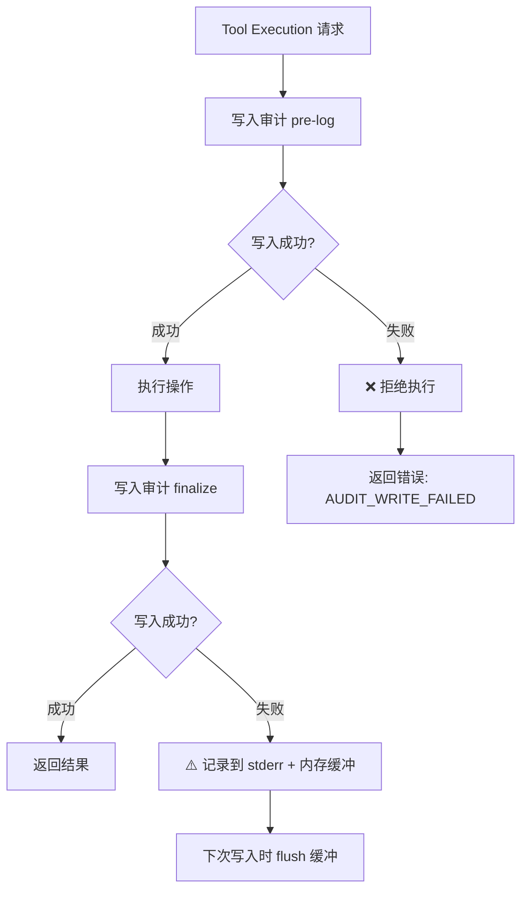
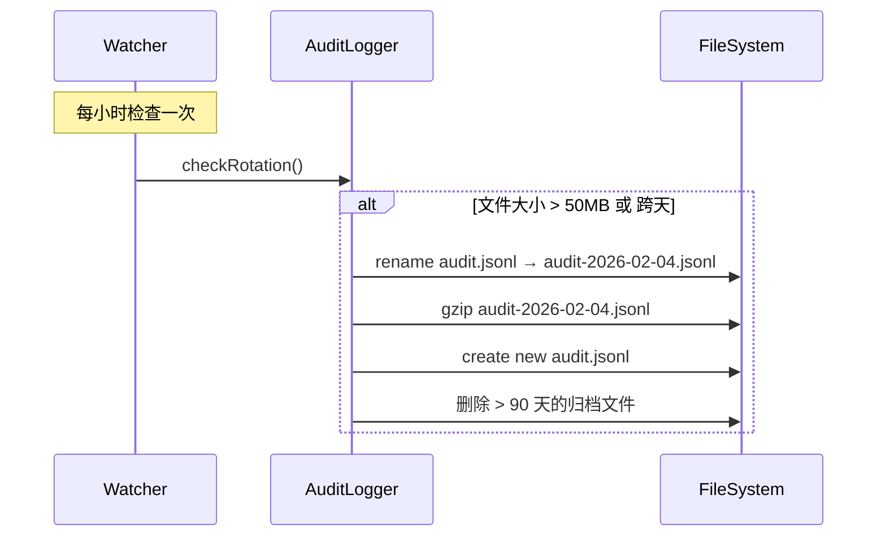
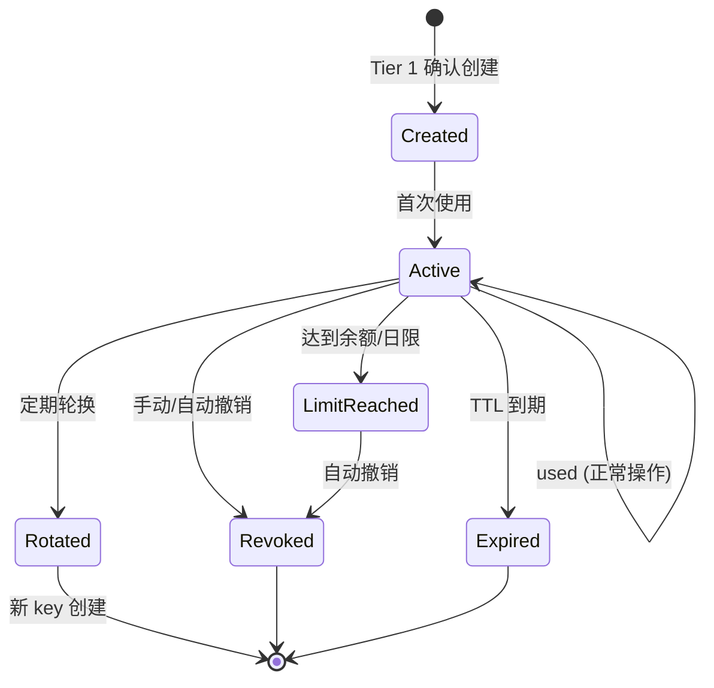
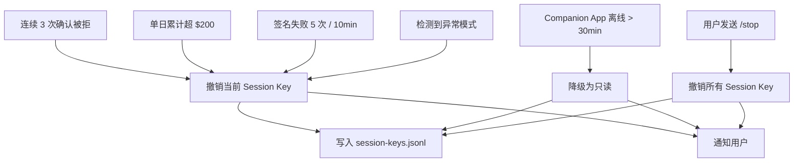
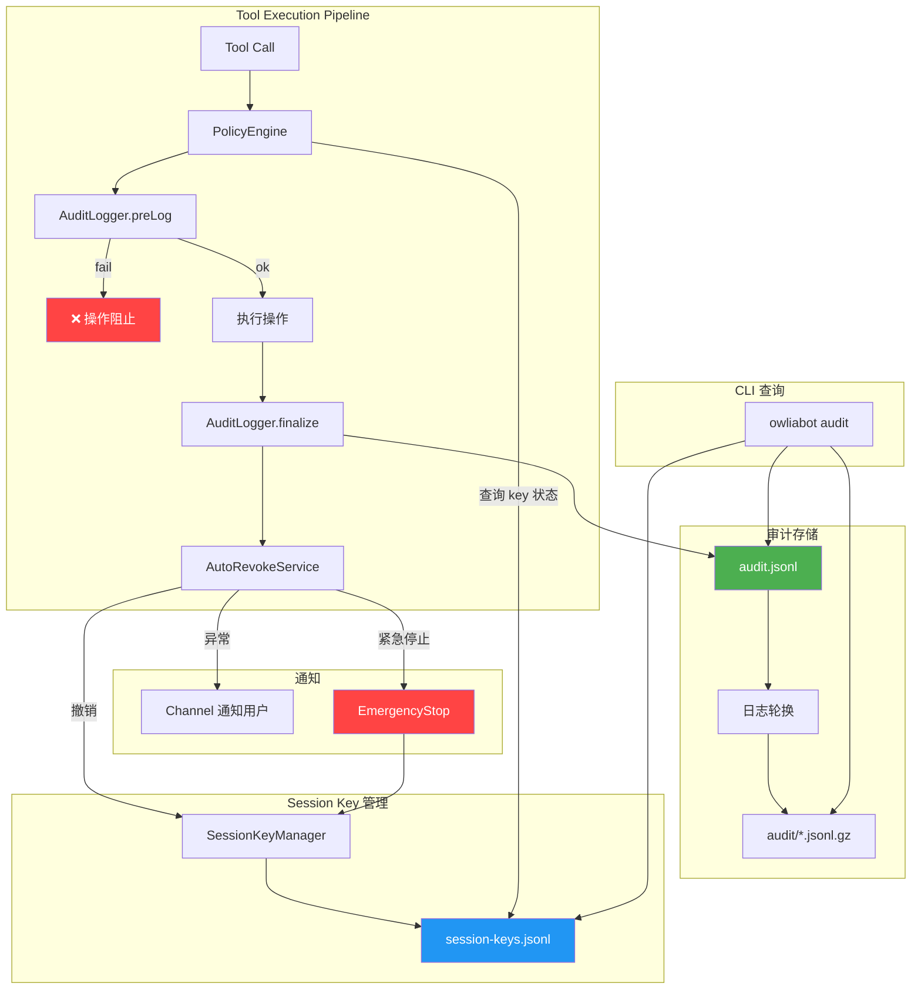

# OwliaBot — 审计与撤销日志策略

> 版本: v0.1 草案  
> 日期: 2026-02-04  
> 依据: `design.md` §2.3.4 审计/撤销, §5.9 Runtime 事件与可观测性

---

## 目录

1. [设计原则](#1-设计原则)
2. [审计日志格式](#2-审计日志格式)
3. [Fail-Closed 策略](#3-fail-closed-策略)
4. [日志轮换与归档](#4-日志轮换与归档)
5. [Session Key 生命周期日志](#5-session-key-生命周期日志)
6. [CLI 查询接口](#6-cli-查询接口)
7. [数据保留与脱敏策略](#7-数据保留与脱敏策略)
8. [与 Tier 模型的自动撤销集成](#8-与-tier-模型的自动撤销集成)
9. [TypeScript 实现](#9-typescript-实现)
10. [集成架构图](#10-集成架构图)

---

## 1. 设计原则

| 原则 | 说明 |
|------|------|
| **Fail-Closed** | 审计写入失败 → 操作不执行。宁可停服也不跳过日志。 |
| **Append-Only** | 日志文件只追加，不修改、不删除（归档后只读）。 |
| **可追溯** | 每条记录包含足够信息重建完整操作链路。 |
| **隐私保护** | 敏感参数（私钥、seed phrase）绝不写入日志；金额、地址保留。 |
| **本地优先** | 日志存储在 workspace 本地，不依赖外部服务。 |

---

## 2. 审计日志格式

### 2.1 存储位置

```
workspace/
├── audit.jsonl              # 当前活跃审计日志
├── audit/
│   ├── audit-2026-02-03.jsonl.gz   # 归档（按日压缩）
│   ├── audit-2026-02-02.jsonl.gz
│   └── ...
├── session-keys.jsonl       # Session Key 生命周期日志
```

### 2.2 审计记录 Schema

每行一个 JSON 对象（JSONL 格式）：

```jsonc
{
  // ── 基础字段 ──
  "id": "audit_01HQXYZ123456",           // ULID（有序、可排序）
  "ts": "2026-02-04T10:30:15.123Z",      // ISO 8601 时间戳
  "version": 1,                            // schema 版本

  // ── 操作信息 ──
  "tool": "dex-swap__swap",               // 工具全名（skill__tool）
  "tier": 2,                              // 策略 tier (1|2|3|"none")
  "effectiveTier": 2,                     // 升级后的实际 tier
  "securityLevel": "sign",                // read|write|sign

  // ── 身份信息 ──
  "user": "telegram:883499266",           // 发起者 sessionKey
  "channel": "telegram",                   // 渠道
  "deviceId": "device_abc123",            // 设备 ID（如有）

  // ── 参数（脱敏） ──
  "params": {
    "from": "USDC",
    "to": "ETH",
    "amount": "50",
    "slippage": "0.5"
    // 注意: 私钥、seed 等绝不出现
  },

  // ── 执行结果 ──
  "result": "success",                    // success|denied|timeout|error|escalated
  "reason": null,                          // 失败原因（denied 时）
  "error": null,                           // 错误详情（error 时）

  // ── 链上信息（仅链上操作） ──
  "txHash": "0xabc123...def456",          // 交易哈希
  "chainId": 8453,                        // 链 ID
  "blockNumber": 12345678,                // 区块号
  "gasUsed": "21000",                     // Gas 使用量
  "gasPrice": "0.001 gwei",              // Gas 价格

  // ── Session Key 信息 ──
  "sessionKeyId": "sk_01HQXYZ789",       // 使用的 session key ID
  "signerTier": "session-key",            // app|session-key|contract

  // ── 确认信息（Tier 1/2） ──
  "confirmation": {
    "required": true,
    "channel": "inline",                   // companion-app|inline|notification
    "requestedAt": "2026-02-04T10:30:15.123Z",
    "respondedAt": "2026-02-04T10:30:22.456Z",
    "approved": true,
    "latencyMs": 7333
  },

  // ── 追踪 ──
  "traceId": "trace_01HQXYZ",            // 关联的 trace ID
  "requestId": "req_01HQXYZ",            // Gateway 请求 ID
  "duration": 1523                        // 操作总耗时 (ms)
}
```

### 2.3 结果枚举

| result | 说明 |
|--------|------|
| `success` | 操作成功完成 |
| `denied` | 策略拒绝或用户拒绝 |
| `timeout` | 确认超时 |
| `error` | 执行错误 |
| `escalated` | 升级到更高 tier（本条记录原 tier） |
| `emergency-stopped` | 紧急停止导致中断 |

---

## 3. Fail-Closed 策略

### 3.1 核心规则

**审计写入是操作执行的前置条件。**



### 3.2 两阶段写入

```typescript
// 阶段 1: Pre-log（操作前）
const entry = await auditLogger.preLog({
  tool: "dex-swap__swap",
  tier: 2,
  user: "telegram:883499266",
  params: { from: "USDC", to: "ETH", amount: "50" },
  sessionKeyId: "sk_01HQXYZ789",
});
// 如果 preLog 失败，直接返回错误，不执行操作

if (!entry.ok) {
  throw new AuditWriteError("Pre-log failed, operation blocked");
}

// 阶段 2: Finalize（操作后）
await auditLogger.finalize(entry.id, {
  result: "success",
  txHash: "0xabc...",
  duration: 1523,
  confirmation: { ... },
});
// 如果 finalize 失败，进入降级模式（内存缓冲 + stderr）
```

### 3.3 降级模式

当文件系统出问题时：

1. **内存缓冲**: 最多缓存 1000 条记录
2. **stderr 输出**: 同时输出到 stderr（可被进程管理器捕获）
3. **重试**: 每 10 秒重试写入文件
4. **报警**: 通过 channel 通知用户 "⚠️ 审计系统异常，已降级运行"
5. **自动恢复**: 文件系统恢复后，flush 内存缓冲

```typescript
// 降级时仍然保持 fail-closed
if (auditLogger.isDegraded() && tier !== "none") {
  // 非只读操作在降级模式下仍然阻止
  return { success: false, error: "Audit system degraded, write/sign ops blocked" };
}
```

---

## 4. 日志轮换与归档

### 4.1 轮换策略

```yaml
# 可在 policy.yml 中配置
audit:
  rotation:
    maxSizeMb: 50          # 单文件最大 50MB
    maxAgeDays: 1          # 按天轮换
    compress: true          # gzip 压缩归档
    archiveDir: "audit/"    # 归档目录

  retention:
    keepDays: 90            # 保留 90 天
    keepForever:            # 永久保留的记录类型
      - "emergency-stopped"
      - tier: 1
```

### 4.2 轮换流程



### 4.3 归档命名

```
audit-{YYYY-MM-DD}.jsonl.gz          # 按天
audit-{YYYY-MM-DD}-{sequence}.jsonl.gz  # 同日多次轮换
```

---

## 5. Session Key 生命周期日志

### 5.1 存储位置

```
workspace/session-keys.jsonl
```

### 5.2 事件类型

| 事件 | 说明 |
|------|------|
| `created` | Session key 生成 |
| `activated` | 开始使用 |
| `used` | 执行了一次操作（摘要） |
| `rotated` | 被新 key 替换 |
| `revoked` | 被用户或系统撤销 |
| `expired` | 自然过期 |
| `limit-reached` | 达到余额/次数上限 |

### 5.3 记录格式

```jsonc
{
  "id": "sklog_01HQXYZ",
  "ts": "2026-02-04T08:00:00.000Z",
  "event": "created",
  "sessionKeyId": "sk_01HQXYZ789",
  "publicKey": "0x04abc...def",           // 公钥（安全）
  "chainId": 8453,
  
  // created 特有字段
  "permissions": {
    "maxBalance": "0.05 ETH",
    "allowedContracts": ["0x...router"],
    "dailyLimit": "$200",
    "expiresAt": "2026-02-05T08:00:00.000Z",
    "ttlHours": 24
  },
  
  // 触发者
  "triggeredBy": "system:startup",        // system:startup|user:telegram:883499266|auto:rotation
  "approvedVia": "companion-app"          // 创建需要 Tier 1 确认
}
```

```jsonc
{
  "id": "sklog_01HQABC",
  "ts": "2026-02-04T10:30:22.456Z",
  "event": "used",
  "sessionKeyId": "sk_01HQXYZ789",
  
  // used 特有字段
  "toolName": "dex-swap__swap",
  "amountUsd": 50,
  "txHash": "0xabc...",
  "auditLogId": "audit_01HQXYZ123456",   // 关联审计记录
  
  // 累计统计
  "stats": {
    "totalUses": 15,
    "dailySpentUsd": 120,
    "remainingDailyUsd": 80,
    "balance": "0.032 ETH"
  }
}
```

```jsonc
{
  "id": "sklog_01HQDEF",
  "ts": "2026-02-04T15:00:00.000Z",
  "event": "revoked",
  "sessionKeyId": "sk_01HQXYZ789",
  
  // revoked 特有字段
  "reason": "consecutive-denials",        // user-manual|consecutive-denials|emergency-stop|anomaly-detected
  "triggeredBy": "system:auto-revoke",
  
  // 最终统计
  "lifetime": {
    "createdAt": "2026-02-04T08:00:00.000Z",
    "revokedAt": "2026-02-04T15:00:00.000Z",
    "durationHours": 7,
    "totalUses": 23,
    "totalSpentUsd": 180
  }
}
```

### 5.4 Session Key 状态机



---

## 6. CLI 查询接口

### 6.1 命令设计

```bash
# 列出审计记录
owliabot audit list
owliabot audit list --tool "dex-swap__swap"
owliabot audit list --tier 1
owliabot audit list --since 2026-02-01
owliabot audit list --result denied
owliabot audit list --user "telegram:883499266"
owliabot audit list --limit 50
owliabot audit list --chain 8453

# 组合查询
owliabot audit list --tier 1 --result denied --since 2026-02-01

# 查看单条详情
owliabot audit show audit_01HQXYZ123456

# 统计概览
owliabot audit stats
owliabot audit stats --since 2026-02-01

# Session Key 日志
owliabot audit keys
owliabot audit keys --id sk_01HQXYZ789
owliabot audit keys --event revoked
owliabot audit keys --active   # 仅显示当前活跃的 key

# 导出
owliabot audit export --since 2026-02-01 --format csv > audit.csv
owliabot audit export --since 2026-02-01 --format json > audit.json
```

### 6.2 输出示例

```
$ owliabot audit list --tier 1 --limit 5

  ID                    TIME                 TOOL                     TIER  RESULT   TX
  ─────────────────────────────────────────────────────────────────────────────────────
  audit_01HQ..456       2026-02-04 10:30     approve__set_allowance   T1    success  0xabc..def
  audit_01HQ..455       2026-02-04 09:15     contract__deploy         T1    denied   -
  audit_01HQ..454       2026-02-03 22:00     wallet__add_session_key  T1    success  0x123..789
  audit_01HQ..453       2026-02-03 18:30     approve__set_allowance   T1    timeout  -
  audit_01HQ..452       2026-02-03 14:00     wallet__revoke_sk        T1    success  0xdef..123

  Showing 5 of 12 records. Use --limit to see more.
```

```
$ owliabot audit stats

  📊 审计统计 (过去 7 天)
  ─────────────────────────────
  总操作数:        1,234
  成功:            1,180 (95.6%)
  拒绝:               32 (2.6%)
  错误:               15 (1.2%)
  超时:                7 (0.6%)

  按 Tier:
    None (只读):      890
    Tier 3 (自动):    210
    Tier 2 (确认):    112
    Tier 1 (App):      22

  链上操作:
    交易数:           344
    总 Gas 费:        $12.35
    总操作金额:       $4,521.00

  Session Keys:
    当前活跃:          1
    7天内创建:         3
    7天内撤销:         2
```

### 6.3 实现要点

```typescript
// src/audit/query.ts

export interface AuditQuery {
  tool?: string;
  tier?: Tier;
  since?: Date;
  until?: Date;
  result?: string;
  user?: string;
  chainId?: number;
  limit?: number;
  offset?: number;
}

export async function queryAuditLog(
  query: AuditQuery,
  logPath: string = "workspace/audit.jsonl"
): Promise<AuditEntry[]> {
  // 1. 确定要搜索的文件列表（当前 + 归档）
  const files = await resolveLogFiles(logPath, query.since, query.until);
  
  // 2. 流式读取 JSONL，逐行过滤
  const results: AuditEntry[] = [];
  for (const file of files) {
    const stream = file.endsWith(".gz") 
      ? createReadStream(file).pipe(createGunzip())
      : createReadStream(file);
    
    for await (const line of readline.createInterface({ input: stream })) {
      const entry = JSON.parse(line) as AuditEntry;
      if (matchesQuery(entry, query)) {
        results.push(entry);
        if (query.limit && results.length >= query.limit) return results;
      }
    }
  }
  
  return results;
}
```

---

## 7. 数据保留与脱敏策略

### 7.1 写入时脱敏

```typescript
// src/audit/redact.ts

const SENSITIVE_KEYS = [
  "privateKey", "private_key", "seed", "mnemonic", "secret",
  "password", "apiKey", "api_key", "token", "auth",
];

const ADDRESS_PATTERN = /^0x[a-fA-F0-9]{40}$/;
const TX_HASH_PATTERN = /^0x[a-fA-F0-9]{64}$/;

export function redactParams(params: Record<string, unknown>): Record<string, unknown> {
  const redacted: Record<string, unknown> = {};
  
  for (const [key, value] of Object.entries(params)) {
    // 完全移除敏感字段
    if (SENSITIVE_KEYS.some(sk => key.toLowerCase().includes(sk))) {
      redacted[key] = "[REDACTED]";
      continue;
    }
    
    // 地址保留（公开信息）
    if (typeof value === "string" && ADDRESS_PATTERN.test(value)) {
      redacted[key] = value; // 地址不脱敏
      continue;
    }
    
    // 长字符串截断
    if (typeof value === "string" && value.length > 200) {
      redacted[key] = value.slice(0, 50) + "...[truncated]";
      continue;
    }
    
    redacted[key] = value;
  }
  
  return redacted;
}
```

### 7.2 归档时脱敏（时间衰减）

| 时段 | 保留粒度 | 说明 |
|------|----------|------|
| 0-7天 | 完整记录 | 所有字段保留（已写入脱敏的除外） |
| 7-30天 | 完整记录 | 保持不变 |
| 30-90天 | 参数摘要 | `params` 字段替换为哈希摘要 |
| 90天+ | 删除或仅保留 Tier 1 | 只读/Tier 3 操作删除，Tier 1/2 永久保留 |

```typescript
// 30 天后的参数摘要化
function summarizeParams(entry: AuditEntry): AuditEntry {
  return {
    ...entry,
    params: {
      _summary: true,
      _hash: sha256(JSON.stringify(entry.params)),
      _keys: Object.keys(entry.params),
    },
  };
}
```

### 7.3 永久保留

以下记录永不删除：

- 所有 Tier 1 操作
- 所有 `result: "denied"` 的 Tier 2 操作
- 所有 `emergency-stopped` 事件
- 所有 session key 的 `created` 和 `revoked` 事件
- 所有链上交易记录（有 `txHash` 的）

---

## 8. 与 Tier 模型的自动撤销集成

### 8.1 触发自动撤销的事件



### 8.2 异常检测规则

```typescript
// src/audit/anomaly.ts

export interface AnomalyRule {
  id: string;
  description: string;
  check: (recentEntries: AuditEntry[]) => AnomalyResult | null;
  action: "revoke-session-key" | "pause-tool" | "notify" | "emergency-stop";
}

export const defaultRules: AnomalyRule[] = [
  {
    id: "consecutive-denials",
    description: "连续 3 次确认被用户拒绝",
    check: (entries) => {
      const recent = entries.slice(-3);
      if (recent.length === 3 && recent.every(e => e.result === "denied")) {
        return { ruleId: "consecutive-denials", severity: "high" };
      }
      return null;
    },
    action: "revoke-session-key",
  },
  
  {
    id: "rapid-sign-failures",
    description: "10 分钟内 5 次签名失败",
    check: (entries) => {
      const tenMinAgo = Date.now() - 10 * 60 * 1000;
      const failures = entries.filter(
        e => e.result === "error" && e.securityLevel === "sign"
          && new Date(e.ts).getTime() > tenMinAgo
      );
      if (failures.length >= 5) {
        return { ruleId: "rapid-sign-failures", severity: "critical" };
      }
      return null;
    },
    action: "emergency-stop",
  },
  
  {
    id: "daily-limit-breach",
    description: "日累计操作金额超过阈值",
    check: (entries) => {
      const todayStart = new Date().setHours(0, 0, 0, 0);
      const todayEntries = entries.filter(
        e => new Date(e.ts).getTime() > todayStart && e.result === "success"
      );
      // 简化：实际需要从 params 中提取金额
      // 这里通过 session-keys.jsonl 中的 stats 获取
      return null;
    },
    action: "revoke-session-key",
  },
  
  {
    id: "unknown-contract-interaction",
    description: "与未白名单合约交互",
    check: (entries) => {
      // 检查最近的 sign 操作是否涉及白名单外合约
      return null;
    },
    action: "notify",
  },
];
```

### 8.3 撤销流程

```typescript
// src/audit/auto-revoke.ts

export class AutoRevokeService {
  private recentEntries: AuditEntry[] = [];
  private readonly maxBufferSize = 100;

  /** 每次审计写入后调用 */
  async onAuditEntry(entry: AuditEntry): Promise<void> {
    this.recentEntries.push(entry);
    if (this.recentEntries.length > this.maxBufferSize) {
      this.recentEntries.shift();
    }

    for (const rule of defaultRules) {
      const anomaly = rule.check(this.recentEntries);
      if (anomaly) {
        await this.executeAction(rule, anomaly, entry);
      }
    }
  }

  private async executeAction(
    rule: AnomalyRule,
    anomaly: AnomalyResult,
    trigger: AuditEntry
  ): Promise<void> {
    switch (rule.action) {
      case "revoke-session-key":
        await this.sessionKeyManager.revokeCurrent(rule.id);
        await this.sessionKeyLogger.log({
          event: "revoked",
          sessionKeyId: trigger.sessionKeyId,
          reason: rule.id,
          triggeredBy: `system:auto-revoke:${rule.id}`,
        });
        await this.notifyUser(`⚠️ Session Key 已自动撤销: ${rule.description}`);
        break;

      case "emergency-stop":
        await this.emergencyStop.execute(rule.id);
        break;

      case "notify":
        await this.notifyUser(`🔔 异常检测: ${rule.description}`);
        break;

      case "pause-tool":
        await this.policyEngine.pauseTool(trigger.tool, rule.id);
        break;
    }
  }
}
```

---

## 9. TypeScript 实现

### 9.1 AuditLogger

```typescript
// src/audit/logger.ts

import { createWriteStream, type WriteStream } from "node:fs";
import { appendFile, stat, rename, mkdir } from "node:fs/promises";
import { createGzip } from "node:zlib";
import { pipeline } from "node:stream/promises";
import { redactParams } from "./redact.js";
import { createLogger } from "../utils/logger.js";

const log = createLogger("audit");

export interface AuditEntry {
  id: string;
  ts: string;
  version: number;
  tool: string;
  tier: number | "none";
  effectiveTier: number | "none";
  securityLevel: "read" | "write" | "sign";
  user: string;
  channel: string;
  deviceId?: string;
  params: Record<string, unknown>;
  result: "success" | "denied" | "timeout" | "error" | "escalated" | "emergency-stopped";
  reason?: string;
  error?: string;
  txHash?: string;
  chainId?: number;
  blockNumber?: number;
  gasUsed?: string;
  sessionKeyId?: string;
  signerTier?: string;
  confirmation?: {
    required: boolean;
    channel: string;
    requestedAt: string;
    respondedAt?: string;
    approved?: boolean;
    latencyMs?: number;
  };
  traceId?: string;
  requestId?: string;
  duration?: number;
}

export interface PreLogResult {
  ok: boolean;
  id: string;
  error?: string;
}

export class AuditLogger {
  private logPath: string;
  private degraded = false;
  private memoryBuffer: string[] = [];
  private readonly maxBufferSize = 1000;
  private autoRevokeService?: AutoRevokeService;

  constructor(logPath: string = "workspace/audit.jsonl") {
    this.logPath = logPath;
  }

  /** 阶段 1: 操作前写入 */
  async preLog(partial: Partial<AuditEntry>): Promise<PreLogResult> {
    const id = generateULID();
    const entry: Partial<AuditEntry> = {
      id,
      ts: new Date().toISOString(),
      version: 1,
      result: "pending" as any, // 占位，finalize 时更新
      ...partial,
      params: partial.params ? redactParams(partial.params as Record<string, unknown>) : {},
    };

    try {
      await this.writeLine(JSON.stringify(entry));
      return { ok: true, id };
    } catch (err) {
      log.error("Audit pre-log failed", err);
      this.degraded = true;
      return { ok: false, id, error: String(err) };
    }
  }

  /** 阶段 2: 操作后更新 */
  async finalize(
    id: string,
    result: AuditEntry["result"],
    reason?: string,
    txHash?: string,
    extra?: Partial<AuditEntry>
  ): Promise<void> {
    const update = {
      _finalize: id,
      ts: new Date().toISOString(),
      result,
      reason,
      txHash,
      ...extra,
    };

    try {
      await this.writeLine(JSON.stringify(update));
      
      // 触发异常检测
      if (this.autoRevokeService) {
        await this.autoRevokeService.onAuditEntry({ id, result, ...extra } as AuditEntry);
      }
    } catch (err) {
      // finalize 失败进入降级模式但不阻止返回结果
      log.error("Audit finalize failed, entering degraded mode", err);
      this.degraded = true;
      this.bufferLine(JSON.stringify(update));
    }
  }

  isDegraded(): boolean {
    return this.degraded;
  }

  private async writeLine(line: string): Promise<void> {
    // 先 flush 内存缓冲
    if (this.memoryBuffer.length > 0) {
      const buffered = this.memoryBuffer.splice(0);
      for (const bl of buffered) {
        await appendFile(this.logPath, bl + "\n", "utf-8");
      }
      this.degraded = false;
    }
    
    await appendFile(this.logPath, line + "\n", "utf-8");
  }

  private bufferLine(line: string): void {
    if (this.memoryBuffer.length >= this.maxBufferSize) {
      this.memoryBuffer.shift(); // 丢弃最旧的
    }
    this.memoryBuffer.push(line);
    process.stderr.write(`[AUDIT-DEGRADED] ${line}\n`);
  }
}

function generateULID(): string {
  // 简化实现，实际使用 ulid 包
  const ts = Date.now().toString(36).padStart(10, "0");
  const rand = Math.random().toString(36).slice(2, 12);
  return `audit_${ts}${rand}`;
}
```

### 9.2 SessionKeyLogger

```typescript
// src/audit/session-key-logger.ts

export interface SessionKeyEvent {
  id: string;
  ts: string;
  event: "created" | "activated" | "used" | "rotated" | "revoked" | "expired" | "limit-reached";
  sessionKeyId: string;
  publicKey?: string;
  chainId?: number;
  permissions?: {
    maxBalance: string;
    allowedContracts: string[];
    dailyLimit: string;
    expiresAt: string;
    ttlHours: number;
  };
  toolName?: string;
  amountUsd?: number;
  txHash?: string;
  auditLogId?: string;
  reason?: string;
  triggeredBy: string;
  approvedVia?: string;
  stats?: {
    totalUses: number;
    dailySpentUsd: number;
    remainingDailyUsd: number;
    balance: string;
  };
  lifetime?: {
    createdAt: string;
    revokedAt: string;
    durationHours: number;
    totalUses: number;
    totalSpentUsd: number;
  };
}

export class SessionKeyLogger {
  private logPath: string;

  constructor(logPath: string = "workspace/session-keys.jsonl") {
    this.logPath = logPath;
  }

  async log(event: Omit<SessionKeyEvent, "id" | "ts">): Promise<void> {
    const entry: SessionKeyEvent = {
      id: `sklog_${Date.now().toString(36)}${Math.random().toString(36).slice(2, 8)}`,
      ts: new Date().toISOString(),
      ...event,
    };
    await appendFile(this.logPath, JSON.stringify(entry) + "\n", "utf-8");
  }

  async getActiveKeys(): Promise<SessionKeyEvent[]> {
    // 读取所有事件，构建状态机，返回未 revoked/expired 的 key
    const events = await this.readAll();
    const keyStates = new Map<string, string>();
    
    for (const e of events) {
      keyStates.set(e.sessionKeyId, e.event);
    }
    
    const activeKeyIds = [...keyStates.entries()]
      .filter(([_, state]) => !["revoked", "expired"].includes(state))
      .map(([id]) => id);
    
    return events.filter(
      e => activeKeyIds.includes(e.sessionKeyId) && e.event === "created"
    );
  }

  private async readAll(): Promise<SessionKeyEvent[]> {
    const content = await readFile(this.logPath, "utf-8").catch(() => "");
    return content.split("\n").filter(Boolean).map(l => JSON.parse(l));
  }
}
```

---

## 10. 集成架构图



### 数据流总结

```
Tool Call
  │
  ├─→ PolicyEngine (policy.yml) → 决定 Tier / 是否确认 / Signer
  │
  ├─→ AuditLogger.preLog → audit.jsonl  (fail → 阻止)
  │
  ├─→ [确认流程] (Tier 1: Companion App / Tier 2: Inline)
  │
  ├─→ [Signer 签名 + 执行]
  │
  ├─→ AuditLogger.finalize → audit.jsonl
  │
  ├─→ AutoRevokeService → 异常检测 → 可能撤销 Session Key
  │
  └─→ SessionKeyLogger → session-keys.jsonl
```
