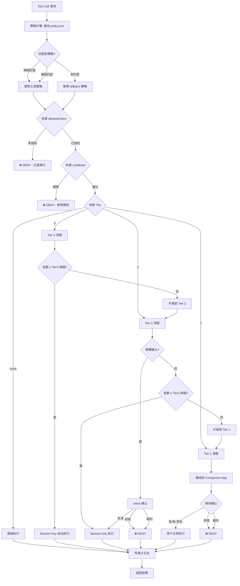
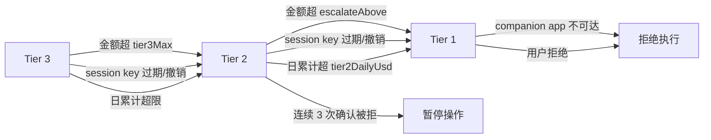
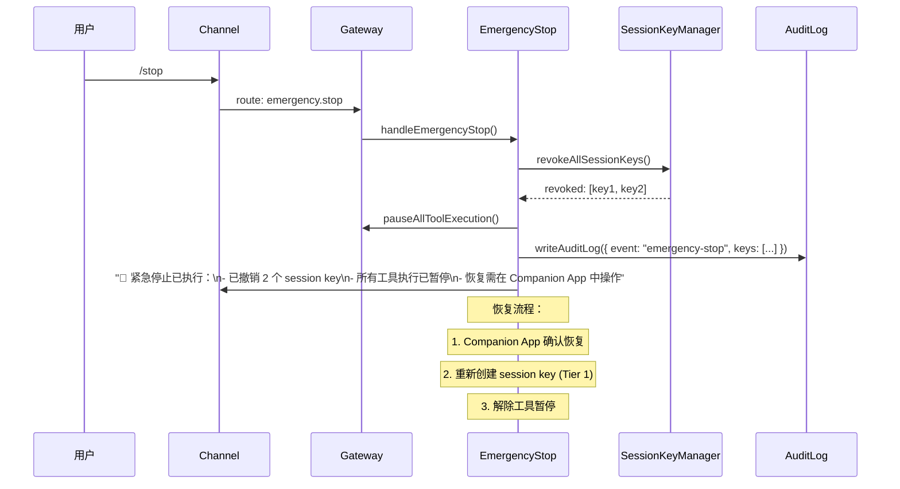

# OwliaBot — Tier 1/2/3 工具级策略设计

> 版本: v0.1 草案  
> 日期: 2026-02-04  
> 依据: `design.md` 安全模型 §2, Tool 接口 §5.2, Signer 接口 §5.3

---

## 目录

1. [概述](#1-概述)
2. [工具分类映射](#2-工具分类映射)
3. [策略 Schema (policy.yml)](#3-策略-schema-policyyml)
4. [TypeScript 类型定义](#4-typescript-类型定义)
5. [各 Tier 执行流程](#5-各-tier-执行流程)
6. [自动升级（Escalation）](#6-自动升级escalation)
7. [紧急停止（Emergency Stop）](#7-紧急停止emergency-stop)
8. [与现有代码的集成点](#8-与现有代码的集成点)

---

## 1. 概述

当前 `executor.ts` 中只有一个粗粒度的门禁：

```typescript
// MVP: Only allow read-level tools without confirmation
if (tool.security.level !== "read") {
  return { success: false, error: "requires confirmation (not implemented)" };
}
```

本设计将 `security.level: read | write | sign` 细化为 **Tier none / 3 / 2 / 1** 四级策略，并在 `policy.yml` 中声明式定义每个工具的安全行为，使 `executor.ts` 可以根据策略自动选择确认通道和签名者。

### 核心映射关系

```
security.level    →    默认 Tier
─────────────────────────────────
read              →    none（无需确认）
write             →    3（低风险自动执行）
sign              →    2 或 1（取决于金额 / 合约类型）
```

策略可以 **覆盖** 默认 Tier——例如 `write` 操作涉及删除文件，可手动设为 Tier 2 要求 inline 确认。

---

## 2. 工具分类映射

### 2.1 内置工具（`src/agent/tools/builtin/`）

| 工具 | security.level | 默认 Tier | 说明 |
|------|---------------|-----------|------|
| `echo` | read | none | 测试回显 |
| `help` | read | none | 帮助信息 |
| `list_files` | read | none | 列出文件 |
| `memory_get` | read | none | 读取记忆 |
| `memory_search` | read | none | 语义搜索 |
| `edit_file` | write | 3 | 编辑 workspace 文件 |
| `clear_session` | write | 3 | 清空会话 |
| `cron` | write | 3 | 创建/修改定时任务 |

### 2.2 Skill 工具（`workspace/skills/`）

#### 只读查询类

| 工具 | security.level | 默认 Tier | 说明 |
|------|---------------|-----------|------|
| `crypto-price__get_price` | read | none | 查询币价 |
| `crypto-balance__get_balance` | read | none | 查询余额 |
| `*__get_*` / `*__list_*` / `*__check_*` | read | none | 通配：只读查询 |

#### 链上写操作类

| 工具 | security.level | 默认 Tier | 金额阈值 | 说明 |
|------|---------------|-----------|----------|------|
| `dex-swap__swap` | sign | **2** | ≤ $50 自动, > $50 升 Tier 1 | DEX swap |
| `transfer__send_token` | sign | **2** | ≤ $20 自动, > $20 升 Tier 1 | Token 转账 |
| `transfer__send_native` | sign | **2** | ≤ $20 自动, > $20 升 Tier 1 | ETH/原生币转账 |
| `defi__claim_rewards` | sign | **2** | 无限额（claim 无资金风险） | 领取奖励 |
| `gas__refuel` | sign | **3** | ≤ $5 固定上限 | Gas 代付 |

#### 高危操作类

| 工具 | security.level | 默认 Tier | 说明 |
|------|---------------|-----------|------|
| `approve__set_allowance` | sign | **1** | 授权第三方合约操作 token |
| `wallet__export_key` | sign | **1** | 导出任何密钥 |
| `contract__deploy` | sign | **1** | 部署合约 |
| `wallet__add_session_key` | sign | **1** | 创建新的 session key |
| `wallet__revoke_session_key` | sign | **1** | 撤销 session key |
| `*__approve_*` / `*__revoke_*` | sign | **1** | 通配：授权/撤销类 |

### 2.3 系统能力类（`system-capability`）

| 能力 | security.level | 默认 Tier | 说明 |
|------|---------------|-----------|------|
| `web.search` | read | none | 网络搜索 |
| `web.fetch` | read | none | 页面抓取 |
| `exec` | write | **2** | 命令执行，需 inline 确认 |
| `playwright.*` (read) | read | none | 浏览器只读 |
| `playwright.*` (write) | write | 3 | 浏览器写操作 |

---

## 3. 策略 Schema (policy.yml)

### 3.1 完整示例

```yaml
# workspace/policy.yml
# OwliaBot 工具安全策略

version: "1"

# 全局默认值
defaults:
  tier: none
  requireConfirmation: false
  confirmationChannel: inline
  cooldown: null
  allowedUsers: assignee-only
  timeout: 120  # 秒，Tier 1 确认超时

# Tier 阈值配置（用于 sign 级别工具的自动分级）
thresholds:
  tier2MaxUsd: 50      # Session Key 单笔最大美元额
  tier2DailyUsd: 200   # Session Key 日累计最大美元额
  tier3MaxUsd: 5       # Tier 3 自动执行最大美元额
  sessionKeyTtlHours: 24
  sessionKeyMaxBalance: "0.05"  # ETH

# 紧急停止
emergencyStop:
  enabled: true
  commands:
    - "/stop"
    - "/emergency"
    - "/halt"
  channels:
    - companion-app
    - telegram
    - discord
  action: revoke-all-session-keys

# 工具策略
tools:
  # ── 无需确认 ──
  "echo":
    tier: none

  "help":
    tier: none

  "list_files":
    tier: none

  "memory_get":
    tier: none

  "memory_search":
    tier: none

  "crypto-price__get_price":
    tier: none

  "crypto-balance__get_balance":
    tier: none

  # ── Tier 3: 自动执行，仅记录日志 ──
  "edit_file":
    tier: 3
    requireConfirmation: false

  "clear_session":
    tier: 3
    requireConfirmation: false

  "cron":
    tier: 3
    requireConfirmation: true  # 创建/修改定时任务需要确认
    allowedUsers: ["assignee-only"]

  "gas__refuel":
    tier: 3
    requireConfirmation: false
    maxAmount:
      usd: 5
    cooldown:
      maxPerHour: 10
      maxPerDay: 50

  # ── Tier 2: Session Key，按阈值确认 ──
  "dex-swap__swap":
    tier: 2
    requireConfirmation: true
    confirmationChannel: inline
    maxAmount:
      usd: 50
    cooldown:
      maxPerHour: 5
      maxPerDay: 20
    escalateAbove:
      usd: 50

  "transfer__send_token":
    tier: 2
    requireConfirmation: true
    confirmationChannel: inline
    maxAmount:
      usd: 20
    cooldown:
      maxPerHour: 3
      maxPerDay: 10
    escalateAbove:
      usd: 20

  "transfer__send_native":
    tier: 2
    requireConfirmation: true
    confirmationChannel: inline
    maxAmount:
      usd: 20
    escalateAbove:
      usd: 20

  "defi__claim_rewards":
    tier: 2
    requireConfirmation: false
    cooldown:
      maxPerHour: 2

  # ── Tier 1: 必须 Companion App 确认 ──
  "approve__set_allowance":
    tier: 1
    requireConfirmation: true
    confirmationChannel: companion-app
    cooldown:
      maxPerHour: 2
      maxPerDay: 5

  "contract__deploy":
    tier: 1
    requireConfirmation: true
    confirmationChannel: companion-app

  "wallet__add_session_key":
    tier: 1
    requireConfirmation: true
    confirmationChannel: companion-app

  "wallet__revoke_session_key":
    tier: 1
    requireConfirmation: true
    confirmationChannel: companion-app

  "exec":
    tier: 2
    requireConfirmation: true
    confirmationChannel: inline
    cooldown:
      maxPerHour: 20

# 通配规则（按顺序匹配，第一个匹配生效）
wildcards:
  - pattern: "*__get_*"
    tier: none
  - pattern: "*__list_*"
    tier: none
  - pattern: "*__check_*"
    tier: none
  - pattern: "*__approve_*"
    tier: 1
    requireConfirmation: true
    confirmationChannel: companion-app
  - pattern: "*__revoke_*"
    tier: 1
    requireConfirmation: true
    confirmationChannel: companion-app
  - pattern: "*__swap_*"
    tier: 2
    requireConfirmation: true
    confirmationChannel: inline
  - pattern: "*__send_*"
    tier: 2
    requireConfirmation: true
    confirmationChannel: inline

# 未匹配工具的 fallback（安全保守）
fallback:
  tier: 1
  requireConfirmation: true
  confirmationChannel: companion-app
```

### 3.2 Schema 校验（Zod）

```typescript
// src/policy/schema.ts
import { z } from "zod";

const amountLimitSchema = z.object({
  usd: z.number().positive().optional(),
  eth: z.string().optional(),
  token: z.string().optional(),
});

const cooldownSchema = z.object({
  maxPerHour: z.number().int().positive().optional(),
  maxPerDay: z.number().int().positive().optional(),
  minIntervalMs: z.number().int().positive().optional(),
});

const tierSchema = z.union([
  z.literal("none"),
  z.literal(1),
  z.literal(2),
  z.literal(3),
]);

const confirmationChannelSchema = z.enum([
  "companion-app",
  "inline",
  "notification",
]);

const toolPolicySchema = z.object({
  tier: tierSchema,
  requireConfirmation: z.boolean().optional(),
  confirmationChannel: confirmationChannelSchema.optional(),
  maxAmount: amountLimitSchema.optional(),
  cooldown: cooldownSchema.optional(),
  allowedUsers: z.union([
    z.literal("assignee-only"),
    z.array(z.string()),
  ]).optional(),
  escalateAbove: amountLimitSchema.optional(),
  timeout: z.number().optional(),
});

export const policySchema = z.object({
  version: z.literal("1"),
  defaults: toolPolicySchema.partial(),
  thresholds: z.object({
    tier2MaxUsd: z.number(),
    tier2DailyUsd: z.number(),
    tier3MaxUsd: z.number(),
    sessionKeyTtlHours: z.number(),
    sessionKeyMaxBalance: z.string(),
  }),
  emergencyStop: z.object({
    enabled: z.boolean(),
    commands: z.array(z.string()),
    channels: z.array(z.string()),
    action: z.enum(["revoke-all-session-keys", "pause-all", "shutdown"]),
  }),
  tools: z.record(z.string(), toolPolicySchema),
  wildcards: z.array(
    toolPolicySchema.extend({ pattern: z.string() })
  ).optional(),
  fallback: toolPolicySchema,
});

export type PolicyConfig = z.infer<typeof policySchema>;
export type ToolPolicy = z.infer<typeof toolPolicySchema>;
```

---

## 4. TypeScript 类型定义

```typescript
// src/policy/types.ts

export type Tier = "none" | 1 | 2 | 3;
export type ConfirmationChannel = "companion-app" | "inline" | "notification";

/** 策略引擎解析后的结果 */
export interface ResolvedPolicy {
  tier: Tier;
  requireConfirmation: boolean;
  confirmationChannel: ConfirmationChannel;
  maxAmount?: { usd?: number; eth?: string };
  cooldown?: { maxPerHour?: number; maxPerDay?: number };
  allowedUsers: "assignee-only" | string[];
  escalateAbove?: { usd?: number };
  timeout: number; // 秒
}

/** 策略引擎决策结果 */
export interface PolicyDecision {
  action: "allow" | "confirm" | "deny" | "escalate";
  tier: Tier;
  effectiveTier: Tier;  // escalation 后的实际 tier
  reason?: string;
  confirmationChannel?: ConfirmationChannel;
  signerTier: import("../signer/interface.js").SignerTier;
}

/** 确认请求（发送到 Companion App 或 inline） */
export interface TierConfirmationRequest {
  requestId: string;
  tool: string;
  tier: Tier;
  channel: ConfirmationChannel;
  params: Record<string, unknown>;  // 脱敏后的参数
  amount?: { value: string; currency: string; usdEquivalent: number };
  transaction?: {
    to: string;
    value: string;
    data: string;
    chainId: number;
    gasEstimate: string;
  };
  expiresAt: number;  // unix timestamp
  createdAt: number;
}

/** 确认响应 */
export interface TierConfirmationResponse {
  requestId: string;
  approved: boolean;
  signature?: string;  // Tier 1: Companion App 签名
  respondedAt: number;
  respondedBy: string;
}

/** Cooldown 追踪器 */
export interface CooldownState {
  toolName: string;
  hourlyCount: number;
  dailyCount: number;
  hourlyResetAt: number;
  dailyResetAt: number;
  lastExecutedAt: number;
}
```

---

## 5. 各 Tier 执行流程

### 5.1 总体流程图



### 5.2 Tier None — 无确认

```
用户: "BTC 现在多少钱？"
  │
  ▼
Agent → tool_call: crypto-price__get_price({ symbol: "BTC" })
  │
  ▼
PolicyEngine.resolve("crypto-price__get_price")
  → { tier: "none", requireConfirmation: false }
  │
  ▼
直接执行 → 写审计日志 → 返回结果
```

**适用**: 所有 `security.level === "read"` 的工具。无需签名，无确认。

### 5.3 Tier 3 — 低风险自动执行

```
Cron 任务: "检查 gas 余额，不够就 refuel"
  │
  ▼
Agent → tool_call: gas__refuel({ amount: "0.001", chain: "base" })
  │
  ▼
PolicyEngine.resolve("gas__refuel")
  → { tier: 3, maxAmount: { usd: 5 }, cooldown: { maxPerHour: 10 } }
  │
  ▼
检查: 金额 $2.50 ≤ $5 ✓, 本小时第 3 次 ≤ 10 ✓
  │
  ▼
选择 Signer: SessionKeySigner (tier: "session-key", canAutoSign: true)
  │
  ▼
自动签名+广播 → 写审计日志 → 返回 txHash
```

**关键约束**:
- Session Key 余额上限 `sessionKeyMaxBalance`
- 单笔不超过 `tier3MaxUsd`
- cooldown 限制
- **无需用户交互**

### 5.4 Tier 2 — Session Key + Inline 确认

```
用户: "帮我把 50 USDC swap 成 ETH"
  │
  ▼
Agent → tool_call: dex-swap__swap({ from: "USDC", to: "ETH", amount: "50" })
  │
  ▼
PolicyEngine.resolve("dex-swap__swap")
  → { tier: 2, maxAmount: { usd: 50 }, escalateAbove: { usd: 50 } }
  │
  ▼
金额 $50 == escalateAbove → 保持 Tier 2（边界值不升级）
  │
  ▼
requireConfirmation: true → 发送 Inline 确认
  │
  ▼
Bot → Channel Message:
  ┌──────────────────────────────────────┐
  │  🔄 确认 Swap 操作                    │
  │                                       │
  │  工具: dex-swap__swap                 │
  │  操作: 50 USDC → ETH                 │
  │  预估价格: ~0.025 ETH                │
  │  Gas: ~$0.15                          │
  │  滑点保护: 0.5%                       │
  │                                       │
  │  [✅ 确认] [❌ 取消]                   │
  └──────────────────────────────────────┘
  │
  ▼
用户点击确认 → Session Key 签名 → 广播 → 写审计日志
```

**关键约束**:
- 必须在用户发起操作的同一 channel 确认
- 超时默认 120 秒，超时 = 拒绝
- 金额超过 `escalateAbove` → 自动升级到 Tier 1

### 5.5 Tier 1 — Companion App 确认

```
用户: "授权 Uniswap V3 Router 操作我的 USDC"
  │
  ▼
Agent → tool_call: approve__set_allowance({
  token: "USDC", spender: "0x...router", amount: "unlimited"
})
  │
  ▼
PolicyEngine.resolve("approve__set_allowance")
  → { tier: 1, confirmationChannel: "companion-app" }
  │
  ▼
Bot → Channel Message: "⏳ 已发送授权请求到你的 Companion App，请在手机上确认。"
  │
  ▼
Bot → Companion App Push Notification:
  ┌──────────────────────────────────────┐
  │  ⚠️ 授权请求                          │
  │                                       │
  │  操作: Token Approval                 │
  │  Token: USDC (0x...usdc)              │
  │  授权给: Uniswap V3 Router            │
  │         (0x...router)                 │
  │  数量: 无限制 ⚠️                      │
  │  链: Ethereum Mainnet                 │
  │  Gas: ~$3.50                          │
  │                                       │
  │  [🔐 FaceID 确认] [❌ 拒绝]           │
  └──────────────────────────────────────┘
  │
  ▼
用户 FaceID → Companion App 本地签名 → 返回签名
  │
  ▼
Bot 收到签名 → 广播交易 → 写审计日志
  │
  ▼
Bot → Channel Message: "✅ 授权完成, tx: 0x...abc"
```

**关键约束**:
- 主私钥永远不离开 Companion App
- 生物识别 / PIN 确认
- 超时默认 120 秒
- 交易详情完整展示（金额、目标、Gas、链）

---

## 6. 自动升级（Escalation）

### 6.1 升级触发条件



### 6.2 升级逻辑伪代码

```typescript
// src/policy/escalation.ts

export function resolveEffectiveTier(
  policy: ResolvedPolicy,
  context: EscalationContext
): PolicyDecision {
  let tier = policy.tier;
  
  // 1. Session Key 可用性检查
  if (tier === 3 || tier === 2) {
    if (!context.sessionKey || context.sessionKey.expired || context.sessionKey.revoked) {
      tier = 1; // session key 不可用，必须走 Companion App
      return { action: "escalate", tier: policy.tier, effectiveTier: 1,
               reason: "session-key-unavailable", signerTier: "app" };
    }
  }
  
  // 2. 金额阈值检查
  if (context.amountUsd !== undefined) {
    if (tier === 3 && context.amountUsd > context.thresholds.tier3MaxUsd) {
      tier = 2; // 超过 Tier 3 上限，升级到 Tier 2
    }
    if (tier === 2 && policy.escalateAbove?.usd && context.amountUsd > policy.escalateAbove.usd) {
      tier = 1; // 超过 escalateAbove，升级到 Tier 1
    }
  }
  
  // 3. 日累计检查
  if (tier === 2 && context.dailySpentUsd > context.thresholds.tier2DailyUsd) {
    tier = 1;
    return { action: "escalate", tier: policy.tier, effectiveTier: 1,
             reason: "daily-limit-exceeded", signerTier: "app" };
  }
  
  // 4. 连续拒绝检查
  if (context.consecutiveDenials >= 3) {
    return { action: "deny", tier: policy.tier, effectiveTier: tier,
             reason: "consecutive-denials-halt", signerTier: "app" };
  }
  
  // 5. 映射到 SignerTier
  const signerTier: SignerTier = tier === 1 ? "app" 
    : (tier === 2 || tier === 3) ? "session-key" 
    : "none"; // tier none 不需要签名，跳过 signer
  
  return {
    action: (tier === 1 || (policy.requireConfirmation && tier !== "none")) ? "confirm" : "allow",
    tier: policy.tier,
    effectiveTier: tier,
    signerTier,
    confirmationChannel: tier === 1 ? "companion-app" : policy.confirmationChannel,
  };
}
```

---

## 7. 紧急停止（Emergency Stop）

### 7.1 触发方式

| 方式 | 渠道 | 说明 |
|------|------|------|
| 命令 | Telegram / Discord | `/stop` / `/emergency` / `/halt` |
| Companion App | 推送 | 一键紧急停止按钮 |
| API | Gateway HTTP | `POST /emergency-stop` |
| 自动触发 | 系统 | 连续异常检测 |

### 7.2 停止流程



### 7.3 自动触发条件

```yaml
# policy.yml 中可配置
autoEmergencyStop:
  # 短时间内多次签名失败
  - condition: "signFailures >= 5 in 10m"
    action: revoke-all-session-keys
  
  # 短时间内大额累计操作
  - condition: "dailySpentUsd >= 500"
    action: pause-all
  
  # Companion App 连接断开超过阈值
  - condition: "companionAppOffline >= 30m"
    action: downgrade-to-read-only
```

---

## 8. 与现有代码的集成点

### 8.1 executor.ts 改造

当前代码：
```typescript
// MVP: Only allow read-level tools without confirmation
if (tool.security.level !== "read") {
  return { success: false, error: "requires confirmation (not implemented)" };
}
```

改造后：
```typescript
// src/agent/tools/executor.ts
import { PolicyEngine } from "../../policy/engine.js";
import { AuditLogger } from "../../audit/logger.js";

export async function executeToolCall(
  call: ToolCall,
  options: ExecutorOptions
): Promise<ToolResult> {
  const { registry, context, policyEngine, auditLogger } = options;
  
  const tool = registry.get(call.name);
  if (!tool) return { success: false, error: `Unknown tool: ${call.name}` };

  // 1. 策略决策
  const decision = await policyEngine.decide(call.name, call.arguments, context);
  
  // 2. 审计日志（fail-closed: 写失败则不执行）
  const auditEntry = await auditLogger.preLog({
    tool: call.name, tier: decision.effectiveTier,
    user: context.sessionKey, params: call.arguments,
  });
  if (!auditEntry.ok) {
    return { success: false, error: "Audit log write failed, operation blocked" };
  }
  
  // 3. 根据决策执行
  switch (decision.action) {
    case "deny":
      await auditLogger.finalize(auditEntry.id, "denied", decision.reason);
      return { success: false, error: decision.reason ?? "Policy denied" };
      
    case "confirm": {
      const confirmed = await requestTierConfirmation(decision, call, context);
      if (!confirmed) {
        await auditLogger.finalize(auditEntry.id, "denied", "user-rejected");
        return { success: false, error: "User rejected the operation" };
      }
      break;
    }
    
    case "escalate":
      // 先 finalize 当前审计条目（标记为 escalated），再递归
      await auditLogger.finalize(auditEntry.id, "escalated", 
        `escalated from tier ${decision.tier} to ${decision.effectiveTier}`);
      return executeWithEscalatedTier(call, options, decision);
      
    case "allow":
      break;
  }
  
  // 4. 选择 signer 并执行
  const signer = selectSigner(decision.signerTier, context);
  const result = await tool.execute(call.arguments, { ...context, signer });
  
  // 5. 最终审计记录
  await auditLogger.finalize(auditEntry.id, result.success ? "success" : "error",
    undefined, result.data?.txHash);
  
  return result;
}
```

### 8.2 新增模块

```
src/
├── policy/
│   ├── schema.ts        # Zod schema for policy.yml
│   ├── types.ts         # TypeScript types
│   ├── engine.ts        # PolicyEngine: resolve + decide
│   ├── loader.ts        # 加载 policy.yml
│   ├── escalation.ts    # 升级逻辑
│   ├── cooldown.ts      # 频率限制追踪
│   └── emergency.ts     # 紧急停止
│
├── audit/
│   ├── logger.ts        # AuditLogger (JSONL)
│   ├── query.ts         # CLI 查询
│   └── rotation.ts      # 日志轮换
```

### 8.3 ToolSecurity 扩展

```typescript
// 现有
export interface ToolSecurity {
  level: "read" | "write" | "sign";
  confirmRequired?: boolean;
  maxValue?: bigint;
  allowedContracts?: string[];
}

// 不修改接口，策略引擎从 policy.yml 补充：
// - level 用于默认 tier 推导
// - policy.yml 中的具体工具配置覆盖默认行为
// - 两者冲突时，policy.yml 优先
```

### 8.4 SignerInterface 与 Tier 的映射

```typescript
// 现有接口不变，通过 tier 选择具体实现
function selectSigner(signerTier: SignerTier, ctx: ToolContext): SignerInterface {
  switch (signerTier) {
    case "app":
      return ctx.signers.appBridge;      // Tier 1: Companion App
    case "session-key":
      return ctx.signers.sessionKey;     // Tier 2/3: 本地 session key
    case "contract":
      return ctx.signers.contractWallet; // Tier 3+: 智能合约钱包
    default:
      throw new Error(`Unknown signer tier: ${signerTier}`);
  }
}
```
